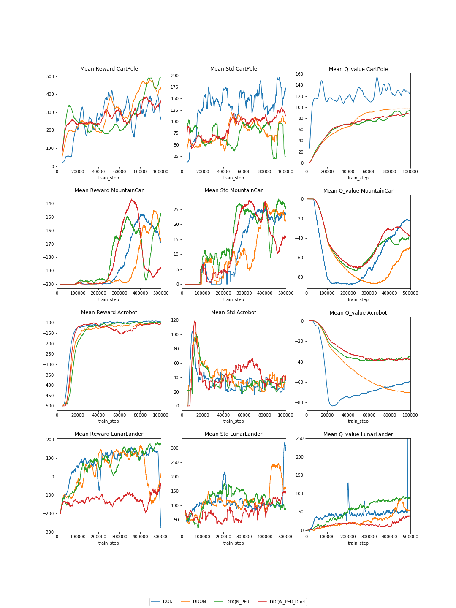
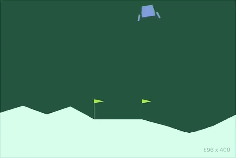
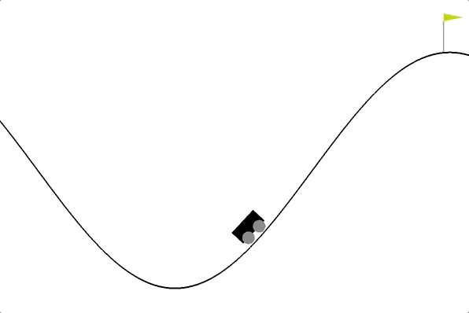

# Deep_Q_Learning
A project for a course in neural networks. Trying different deep reinforcement learning techniques. 

## Techniques implemented
- DQN
- Double DQN
- Prioritized experience replay (proportional) with importance sampling
- Dueling Architecture

# Results
Below are results from LunarLander, MountainCar, Acrobot and CartPole

# Visuals
LunarLander

MountainCar

